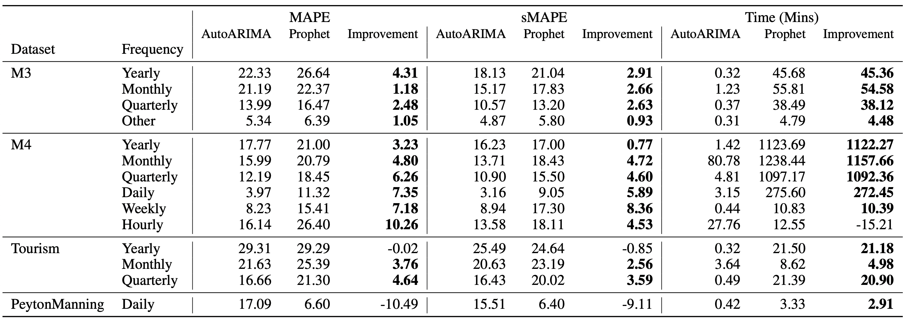

# AutoArima is faster and more accurate than FB-Prophet in most cases.

We benchmarked on more than 100K series and show that you can improve _MAPE_ and _sMAPE_ forecast accuracy by _17%_ and _15%_ with _37x_  less computational time.

Just try this two lines and verify it for yourself.

```python
from prophet import Prophet
from statsforecast.adapters.prophet import AutoARIMAProphet

# BEFORE (slow and innacurate)
model = Prophet()

# AFTER (fast and accurate)
model = AutoARIMAProphet()

model = model.fit(df)
future = model.make_future_dataframe(365)
forecast = model.predict(future)
fig = model.plot(forecast)
```
## Results on M3, M4, Toursim and PeytonManning: 


## Background

[FB-Prophet](https://github.com/facebook/prophet) is one of the world's most used time series forecasting models. Its GitHub repository has more than 14 thousand stars, and more than a hundred repositories depend on it. However, in many scenarios, [FB-Prophet does not offer good performance in terms of time and accuracy.](https://analyticsindiamag.com/why-are-people-bashing-facebook-prophet/) This lacking performance suggests that the FB-Prophet's success can be explained mainly by its usability. For example, [adding exogenous and calendar variables is almost trivial.](https://facebook.github.io/prophet/docs/seasonality,_holiday_effects,_and_regressors.html)

To contribute to the forecasting community, we created a _FB-Prophet API adapter_ that lets you use Prophet's useful methods without accuracy and computational downsides. Just import this AutoARIMAProphet adapter and replace the Prophet class to start using AutoARIMA in any of your existing pipelines.

## Empirical validation

To validate the AutoARIMAProphet adapter, we designed a pipeline considering the M3, M4, and Tourism datasets (standard benchmarks in the forecasting practice) and the Peyton Manning data set orriginaly used by FB.  The pipeline automatically selects ARIMA's parameters with the AIC criterion and selects Prophet's parameters with time-series cross-validation.

## Results 

The following table shows the MAPE, sMAPE and Time (in minutes) AutoARIMA improvements on Prophet for each dataset.




## Reproducibility


1. Create a conda environment `arima_prophet` using the `environment.yml` file.
  ```shell
  conda env create -f environment.yml
  ```

3. Activate the conda environment using 
  ```shell
  conda activate arima_prophet
  ```

4. Run the experiments for each dataset and each model using 
  ```shell
  python -m src.experiment --dataset [dataset] --group [group] --model_name [model_name]
  ```
For `M4`, the groups are `Yearly`, `Monthly`, `Quarterly`, `Weekly`, `Daily`, and `Hourly`. For `M3`, the groups are `Yearly`, `Monthly`, `Quarterly`, and `Other`. For `Tourism`, the groups are `Yearly`, `Monthly`, and `Quarterly`. Finally, for `PeytonManning` the group is `Daily`.

5. Evaluate the results using
  ```shell
  python -m src.evaluation
  ```

## Conclusion
* Be mindful on what you read on Towards Data Science.
* Always use strong baselines when forecasting.
* Quick and easy results are sometimes [misleading](https://en.wikipedia.org/wiki/Streetlight_effect).
* Simpler models are sometimes [better](https://en.wikipedia.org/wiki/Occam%27s_razor).
* **Facebook's Prophet might be many things, but its definitely not a model for forecasting time series at scale.**
