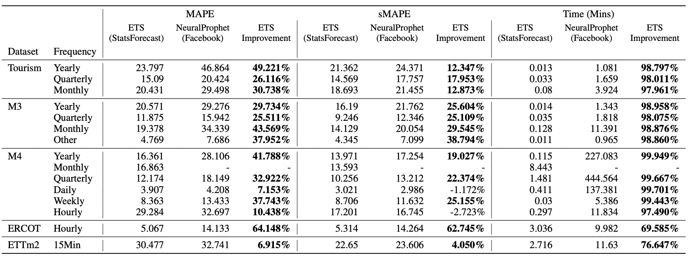

# ETS is faster and more accurate than NeuralProphet in most cases. 

We benchmarked on more than 55K series and show that `ETS` improves _MAPE_ and _sMAPE_ forecast accuracy by _33%_ and _18%_, respectively, with _320x_ less computational time over [`NeuralProphet`](https://neuralprophet.com/html/index.html).

### Install StatsForecast
```bash
pip install statsforecast
```

## Results on M3, M4, and Tourism: 


## Background

Recently, the [`NeuralProphet`](https://neuralprophet.com/html/index.html) model was introduced as "a successor to Facebook `Prophet`" according to the [original paper](https://arxiv.org/pdf/2111.15397.pdf). Recently, a [benchmark experiment](https://github.com/Nixtla/statsforecast/tree/main/experiments/arima_prophet_adapter) showed that the `AutoARIMA` model outperforms `Prophet` on accuracy and computational time by a large margin using standard benchmarking datasets. The primary purpose of this experiment is to determine if the `NeuralProphet` model can outperform classical statistical models, mainly because the paper only compares the new model against `Prophet` but not against simple benchmarks. We wanted to test the claim that "Classical models such as Auto-Regressive Integrated Moving Average (ARIMA) and Exponential Smoothing (ETS) have been well studied and provide interpretable components. However, their restrictive assumptions and parametric nature limit their performance in real-world applications." 

## Empirical validation

To compare `NeuralProphet` against `ETS`, we designed a pipeline considering the M3, M4, and Tourism datasets (standard benchmarks in the forecasting practice). `NeuralProphet` fits the time series globally and produces forecasts using a multistep approach. 

### Notes

- We used the out-of-the-box configuration of the NeuralProphet model in its global-multistep version. This experiment concludes that hyperparameter optimization could be highly costly, particularly for big datasets.
- During the execution of the experiment, we found issues with the NeuralProphet implementation related to Monthly, Quarterly, and Yearly frequencies. We [fixed the issue and opened a Pull Request to solve the problem](https://github.com/ourownstory/neural_prophet/pull/705).

## Results 

The following table shows the _MAPE_, _sMAPE_, and _Time_ (in minutes) `ETS` improvements over `NeuralProphet` for each dataset.




## Reproducibility


1. Create a conda environment `exp_neuralprophet` using the `environment.yml` file.
  ```shell
  conda env create -f environment.yml
  ```

3. Activate the conda environment using 
  ```shell
  conda activate exp_neuralprophet
  ```

4. Run the experiments for each dataset and each model using 
  ```shell
  python -m src.[model] --dataset [dataset] --group [group]
  ```

The variable `model` can be `statsforecast` (`ETS` model) or `neuralprophet`. For `M4`, the groups are `Yearly`, `Quarterly`, `Weekly`, `Daily`, and `Hourly`. For `M3`, the groups are `Yearly`, `Monthly`, `Quarterly`, and `Other`. For `Tourism`, the groups are `Yearly`, `Monthly`, and `Quarterly`. 

5. Evaluate the results using

  ```shell
  python -m src.evaluation
  ```

## Conclusion

* Always use strong baselines when forecasting.
* Quick and easy results are sometimes [misleading](https://en.wikipedia.org/wiki/Streetlight_effect).
* Simpler models are sometimes [better](https://en.wikipedia.org/wiki/Occam%27s_razor).

## Misc.

* [`StatsForecast`](https://github.com/nixtla/statsforecast) also includes a variety of lightning fast baseline models.
* If you really need to do forecast at scale, [here](https://github.com/nixtla/statsforecast/tree/main/experiments/ray) we show how to forecast 1 million time series under 30 minutes using [Ray](https://github.com/ray-project/ray).
* If you are interested in SOTA Deep Learning models, check [`NeuralForecast`](https://github.com/nixtla/neuralforecast)


