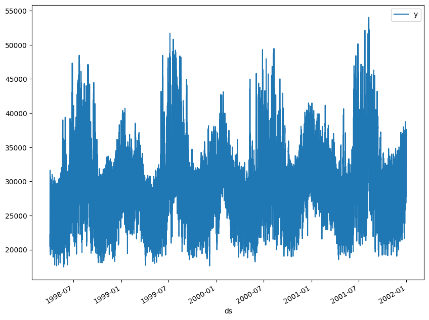
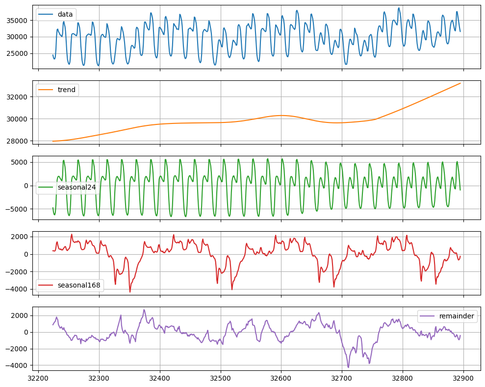
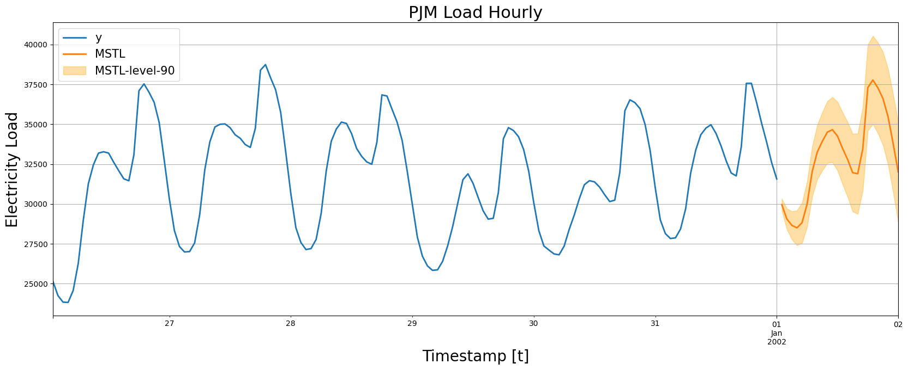
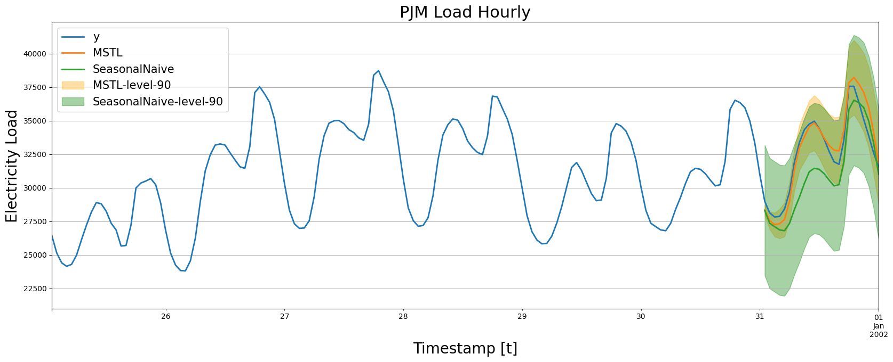
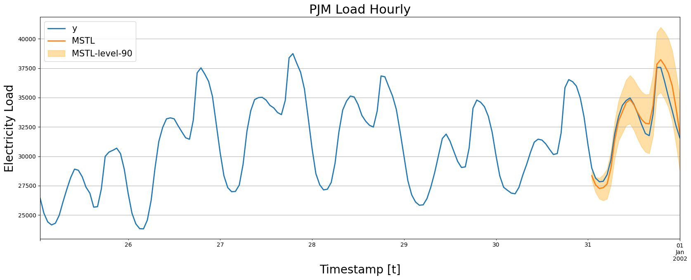
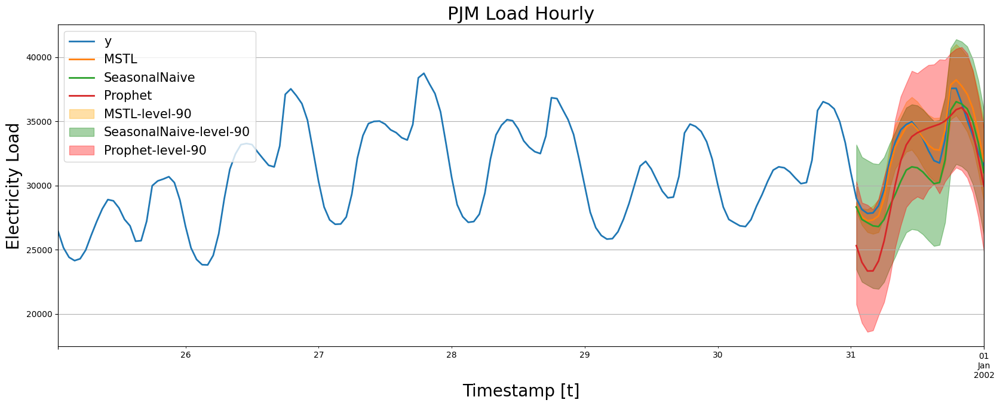
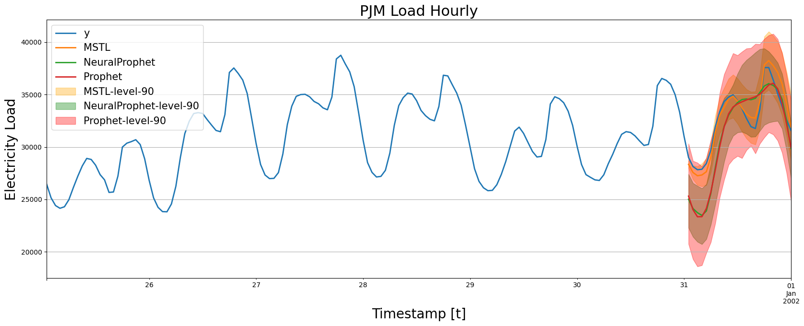

export const quartoRawHtml =
[`<div>
<style scoped>
    .dataframe tbody tr th:only-of-type {
        vertical-align: middle;
    }
    .dataframe tbody tr th {
        vertical-align: top;
    }
    .dataframe thead th {
        text-align: right;
    }
</style>
`,`
</div>`,`<div>
<style scoped>
    .dataframe tbody tr th:only-of-type {
        vertical-align: middle;
    }
    .dataframe tbody tr th {
        vertical-align: top;
    }
    .dataframe thead th {
        text-align: right;
    }
</style>
`,`
<p>32896 rows × 5 columns</p>
</div>`,`<div>
<style scoped>
    .dataframe tbody tr th:only-of-type {
        vertical-align: middle;
    }
    .dataframe tbody tr th {
        vertical-align: top;
    }
    .dataframe thead th {
        text-align: right;
    }
</style>
`,`
</div>`,`<div>
<style scoped>
    .dataframe tbody tr th:only-of-type {
        vertical-align: middle;
    }
    .dataframe tbody tr th {
        vertical-align: top;
    }
    .dataframe thead th {
        text-align: right;
    }
</style>
`,`
</div>`,`<div>
<style scoped>
    .dataframe tbody tr th:only-of-type {
        vertical-align: middle;
    }
    .dataframe tbody tr th {
        vertical-align: top;
    }
    .dataframe thead th {
        text-align: right;
    }
</style>
`,`
</div>`,`<div>
<style scoped>
    .dataframe tbody tr th:only-of-type {
        vertical-align: middle;
    }
    .dataframe tbody tr th {
        vertical-align: top;
    }
    .dataframe thead th {
        text-align: right;
    }
</style>
`,`
</div>`,`<div>
<style scoped>
    .dataframe tbody tr th:only-of-type {
        vertical-align: middle;
    }
    .dataframe tbody tr th {
        vertical-align: top;
    }
    .dataframe thead th {
        text-align: right;
    }
</style>
`,`
</div>`,`<div>
<style scoped>
    .dataframe tbody tr th:only-of-type {
        vertical-align: middle;
    }
    .dataframe tbody tr th {
        vertical-align: top;
    }
    .dataframe thead th {
        text-align: right;
    }
</style>
`,`
</div>`,`<div>
<style scoped>
    .dataframe tbody tr th:only-of-type {
        vertical-align: middle;
    }
    .dataframe tbody tr th {
        vertical-align: top;
    }
    .dataframe thead th {
        text-align: right;
    }
</style>
`,`
</div>`,`<div>
<style scoped>
    .dataframe tbody tr th:only-of-type {
        vertical-align: middle;
    }
    .dataframe tbody tr th {
        vertical-align: top;
    }
    .dataframe thead th {
        text-align: right;
    }
</style>
`,`
</div>`,`<div>
<style scoped>
    .dataframe tbody tr th:only-of-type {
        vertical-align: middle;
    }
    .dataframe tbody tr th {
        vertical-align: top;
    }
    .dataframe thead th {
        text-align: right;
    }
</style>
`,`
</div>`];

::: {.cell 0=‘h’ 1=‘i’ 2=‘d’ 3=‘e’}

<details>
<summary>Code</summary>

``` python
# This is to render Plotly plots into HTML
# For more information, see https://quarto.org/docs/interactive/widgets/jupyter.html#plotly
import plotly.io as pio
pio.renderers.default = "plotly_mimetype+notebook_connected"

import warnings
warnings.simplefilter('ignore')

import logging
logging.getLogger('statsforecast').setLevel(logging.ERROR)
```

</details>

:::

> In this example we will show how to perform electricity load
> forecasting considering a model capable of handling multiple
> seasonalities (MSTL).

<a href="https://colab.research.google.com/github/Nixtla/statsforecast/blob/main/nbs/examples/ElectricityLoadForecasting.ipynb" target="_parent"></a>

## Introduction {#introduction}

Some time series are generated from very low frequency data. These data
generally exhibit multiple seasonalities. For example, hourly data may
exhibit repeated patterns every hour (every 24 observations) or every
day (every 24 \* 7, hours per day, observations). This is the case for
electricity load. Electricity load may vary hourly, e.g., during the
evenings electricity consumption may be expected to increase. But also,
the electricity load varies by week. Perhaps on weekends there is an
increase in electrical activity.

In this example we will show how to model the two seasonalities of the
time series to generate accurate forecasts in a short time. We will use
hourly PJM electricity load data. The original data can be found
[here](https://github.com/jnagura/Energy-consumption-prediction-analysis).

## Libraries {#libraries}

In this example we will use the following libraries:

-   `StatsForecast`. Lightning ⚡️ fast forecasting with statistical and
    econometric models. Includes the MSTL model for multiple
    seasonalities.
-   [`DatasetsForecast`](https://github.com/Nixtla/datasetsforecast).
    Used to evaluate the performance of the forecasts.
-   [`Prophet`](https://github.com/facebook/prophet). Benchmark model
    developed by Facebook.
-   [`NeuralProphet`](https://github.com/ourownstory/neural_prophet).
    Deep Learning version of `Prophet`. Used as benchark.

<details>
<summary>Code</summary>

``` python
%%capture
!pip install statsforecast
!pip install datasetsforecast
!pip install prophet
!pip install "neuralprophet[live]"
```

</details>

## Forecast using Multiple Seasonalities {#forecast-using-multiple-seasonalities}

### Electricity Load Data {#electricity-load-data}

According to the [dataset’s
page](https://www.kaggle.com/datasets/robikscube/hourly-energy-consumption),

> PJM Interconnection LLC (PJM) is a regional transmission organization
> (RTO) in the United States. It is part of the Eastern Interconnection
> grid operating an electric transmission system serving all or parts of
> Delaware, Illinois, Indiana, Kentucky, Maryland, Michigan, New Jersey,
> North Carolina, Ohio, Pennsylvania, Tennessee, Virginia, West
> Virginia, and the District of Columbia. The hourly power consumption
> data comes from PJM’s website and are in megawatts (MW).

Let’s take a look to the data.

<details>
<summary>Code</summary>

``` python
import matplotlib.pyplot as plt
import numpy as np
import pandas as pd

pd.plotting.register_matplotlib_converters()
plt.rc("figure", figsize=(10, 8))
plt.rc("font", size=10)
```

</details>
<details>
<summary>Code</summary>

``` python
df = pd.read_csv('https://raw.githubusercontent.com/panambY/Hourly_Energy_Consumption/master/data/PJM_Load_hourly.csv')
df.columns = ['ds', 'y']
df.insert(0, 'unique_id', 'PJM_Load_hourly')
df['ds'] = pd.to_datetime(df['ds'])
df = df.sort_values(['unique_id', 'ds']).reset_index(drop=True)
df.tail()
```

</details>
<div dangerouslySetInnerHTML={{ __html: quartoRawHtml[0] }} />

|       | unique_id       | ds                  | y       |
|-------|-----------------|---------------------|---------|
| 32891 | PJM_Load_hourly | 2001-12-31 20:00:00 | 36392.0 |
| 32892 | PJM_Load_hourly | 2001-12-31 21:00:00 | 35082.0 |
| 32893 | PJM_Load_hourly | 2001-12-31 22:00:00 | 33890.0 |
| 32894 | PJM_Load_hourly | 2001-12-31 23:00:00 | 32590.0 |
| 32895 | PJM_Load_hourly | 2002-01-01 00:00:00 | 31569.0 |

<div dangerouslySetInnerHTML={{ __html: quartoRawHtml[1] }} />

<details>
<summary>Code</summary>

``` python
df.plot(x='ds', y='y')
```

</details>

``` text
<Axes: xlabel='ds'>
```



We clearly observe that the time series exhibits seasonal patterns.
Moreover, the time series contains `32,896` observations, so it is
necessary to use very computationally efficient methods to display them
in production.

### MSTL model {#mstl-model}

The `MSTL` (Multiple Seasonal-Trend decomposition using LOESS) model,
originally developed by [Kasun Bandara, Rob J Hyndman and Christoph
Bergmeir](https://arxiv.org/abs/2107.13462), decomposes the time series
in multiple seasonalities using a Local Polynomial Regression (LOESS).
Then it forecasts the trend using a custom non-seasonal model and each
seasonality using a `SeasonalNaive` model.

`StatsForecast` contains a fast implementation of the `MSTL` model.
Also, the decomposition of the time series can be calculated.

<details>
<summary>Code</summary>

``` python
from statsforecast import StatsForecast
from statsforecast.models import MSTL, AutoARIMA, SeasonalNaive
from statsforecast.utils import AirPassengers as ap
```

</details>

First we must define the model parameters. As mentioned before, the
electricity load presents seasonalities every 24 hours (Hourly) and
every 24 \* 7 (Daily) hours. Therefore, we will use `[24, 24 * 7]` as
the seasonalities that the MSTL model receives. We must also specify the
manner in which the trend will be forecasted. In this case we will use
the `AutoARIMA` model.

<details>
<summary>Code</summary>

``` python
mstl = MSTL(
    season_length=[24, 24 * 7], # seasonalities of the time series 
    trend_forecaster=AutoARIMA() # model used to forecast trend
)
```

</details>

Once the model is instantiated, we have to instantiate the
`StatsForecast` class to create forecasts.

<details>
<summary>Code</summary>

``` python
sf = StatsForecast(
    models=[mstl], # model used to fit each time series 
    freq='H', # frequency of the data
)
```

</details>

#### Fit the model {#fit-the-model}

Afer that, we just have to use the `fit` method to fit each model to
each time series.

<details>
<summary>Code</summary>

``` python
sf = sf.fit(df=df)
```

</details>

#### Decompose the time series in multiple seasonalities {#decompose-the-time-series-in-multiple-seasonalities}

Once the model is fitted, we can access the decomposition using the
`fitted_` attribute of `StatsForecast`. This attribute stores all
relevant information of the fitted models for each of the time series.

In this case we are fitting a single model for a single time series, so
by accessing the fitted\_ location \[0, 0\] we will find the relevant
information of our model. The `MSTL` class generates a `model_`
attribute that contains the way the series was decomposed.

<details>
<summary>Code</summary>

``` python
sf.fitted_[0, 0].model_
```

</details>
<div dangerouslySetInnerHTML={{ __html: quartoRawHtml[2] }} />

|       | data    | trend        | seasonal24   | seasonal168 | remainder   |
|-------|---------|--------------|--------------|-------------|-------------|
| 0     | 22259.0 | 26183.898892 | -5215.124554 | 609.000432  | 681.225229  |
| 1     | 21244.0 | 26181.599305 | -6255.673234 | 603.823918  | 714.250011  |
| 2     | 20651.0 | 26179.294886 | -6905.329895 | 636.820423  | 740.214587  |
| 3     | 20421.0 | 26176.985472 | -7073.420118 | 615.825999  | 701.608647  |
| 4     | 20713.0 | 26174.670877 | -7062.395760 | 991.521912  | 609.202971  |
| ...   | ...     | ...          | ...          | ...         | ...         |
| 32891 | 36392.0 | 33123.552727 | 4387.149171  | -488.177882 | -630.524015 |
| 32892 | 35082.0 | 33148.242575 | 3479.852929  | -682.928737 | -863.166767 |
| 32893 | 33890.0 | 33172.926165 | 2307.808829  | -650.566775 | -940.168219 |
| 32894 | 32590.0 | 33197.603322 | 748.587723   | -555.177849 | -801.013195 |
| 32895 | 31569.0 | 33222.273902 | -967.124123  | -265.895357 | -420.254422 |

<div dangerouslySetInnerHTML={{ __html: quartoRawHtml[3] }} />

Let’s look graphically at the different components of the time series.

<details>
<summary>Code</summary>

``` python
sf.fitted_[0, 0].model_.tail(24 * 28).plot(subplots=True, grid=True)
plt.tight_layout()
plt.show()
```

</details>



We observe that there is a clear trend towards the high (orange line).
This component would be predicted with the `AutoARIMA` model. We can
also observe that every 24 hours and every `24 * 7` hours there is a
very well defined pattern. These two components will be forecast
separately using a `SeasonalNaive` model.

#### Produce forecasts {#produce-forecasts}

To generate forecasts we only have to use the `predict` method
specifying the forecast horizon (`h`). In addition, to calculate
prediction intervals associated to the forecasts, we can include the
parameter `level` that receives a list of levels of the prediction
intervals we want to build. In this case we will only calculate the 90%
forecast interval (`level=[90]`).

<details>
<summary>Code</summary>

``` python
forecasts = sf.predict(h=24, level=[90])
forecasts.head()
```

</details>
<div dangerouslySetInnerHTML={{ __html: quartoRawHtml[4] }} />

|                 | ds                  | MSTL         | MSTL-lo-90   | MSTL-hi-90   |
|-----------------|---------------------|--------------|--------------|--------------|
| unique_id       |                     |              |              |              |
| PJM_Load_hourly | 2002-01-01 01:00:00 | 29956.744141 | 29585.187500 | 30328.298828 |
| PJM_Load_hourly | 2002-01-01 02:00:00 | 29057.691406 | 28407.498047 | 29707.884766 |
| PJM_Load_hourly | 2002-01-01 03:00:00 | 28654.699219 | 27767.101562 | 29542.298828 |
| PJM_Load_hourly | 2002-01-01 04:00:00 | 28499.009766 | 27407.640625 | 29590.378906 |
| PJM_Load_hourly | 2002-01-01 05:00:00 | 28821.716797 | 27552.236328 | 30091.197266 |

<div dangerouslySetInnerHTML={{ __html: quartoRawHtml[5] }} />

Let’s look at our forecasts graphically.

<details>
<summary>Code</summary>

``` python
_, ax = plt.subplots(1, 1, figsize = (20, 7))
df_plot = pd.concat([df, forecasts]).set_index('ds').tail(24 * 7)
df_plot[['y', 'MSTL']].plot(ax=ax, linewidth=2)
ax.fill_between(df_plot.index, 
                df_plot['MSTL-lo-90'], 
                df_plot['MSTL-hi-90'],
                alpha=.35,
                color='orange',
                label='MSTL-level-90')
ax.set_title('PJM Load Hourly', fontsize=22)
ax.set_ylabel('Electricity Load', fontsize=20)
ax.set_xlabel('Timestamp [t]', fontsize=20)
ax.legend(prop={'size': 15})
ax.grid()
```

</details>



In the next section we will plot different models so it is convenient to
reuse the previous code with the following function.

<details>
<summary>Code</summary>

``` python
def plot_forecasts(y_hist, y_true, y_pred, models):
    _, ax = plt.subplots(1, 1, figsize = (20, 7))
    y_true = y_true.merge(y_pred, how='left', on=['unique_id', 'ds'])
    df_plot = pd.concat([y_hist, y_true]).set_index('ds').tail(24 * 7)
    df_plot[['y'] + models].plot(ax=ax, linewidth=2)
    colors = ['orange', 'green', 'red']
    for model, color in zip(models, colors):
        ax.fill_between(df_plot.index, 
                        df_plot[f'{model}-lo-90'], 
                        df_plot[f'{model}-hi-90'],
                        alpha=.35,
                        color=color,
                        label=f'{model}-level-90')
    ax.set_title('PJM Load Hourly', fontsize=22)
    ax.set_ylabel('Electricity Load', fontsize=20)
    ax.set_xlabel('Timestamp [t]', fontsize=20)
    ax.legend(prop={'size': 15})
    ax.grid()
```

</details>

### Performance of the MSTL model {#performance-of-the-mstl-model}

#### Split Train/Test sets {#split-traintest-sets}

To validate the accuracy of the `MSTL` model, we will show its
performance on unseen data. We will use a classical time series
technique that consists of dividing the data into a training set and a
test set. We will leave the last 24 observations (the last day) as the
test set. So the model will train on `32,872` observations.

<details>
<summary>Code</summary>

``` python
df_test = df.tail(24)
df_train = df.drop(df_test.index)
```

</details>

#### MSTL model {#mstl-model-1}

In addition to the `MSTL` model, we will include the `SeasonalNaive`
model as a benchmark to validate the added value of the `MSTL` model.
Including `StatsForecast` models is as simple as adding them to the list
of models to be fitted.

<details>
<summary>Code</summary>

``` python
sf = StatsForecast(
    models=[mstl, SeasonalNaive(season_length=24)], # add SeasonalNaive model to the list
    freq='H'
)
```

</details>

To measure the fitting time we will use the `time` module.

<details>
<summary>Code</summary>

``` python
from time import time
```

</details>

To retrieve the forecasts of the test set we only have to do fit and
predict as before.

<details>
<summary>Code</summary>

``` python
init = time()
sf = sf.fit(df=df_train)
forecasts_test = sf.predict(h=len(df_test), level=[90])
end = time()
forecasts_test.head()
```

</details>
<div dangerouslySetInnerHTML={{ __html: quartoRawHtml[6] }} />

|                 | ds                  | MSTL         | MSTL-lo-90   | MSTL-hi-90   | SeasonalNaive | SeasonalNaive-lo-90 | SeasonalNaive-hi-90 |
|-----------------|---------------------|--------------|--------------|--------------|---------------|---------------------|---------------------|
| unique_id       |                     |              |              |              |               |                     |                     |
| PJM_Load_hourly | 2001-12-31 01:00:00 | 28345.212891 | 27973.572266 | 28716.853516 | 28326.0       | 23468.693359        | 33183.304688        |
| PJM_Load_hourly | 2001-12-31 02:00:00 | 27567.455078 | 26917.085938 | 28217.824219 | 27362.0       | 22504.693359        | 32219.306641        |
| PJM_Load_hourly | 2001-12-31 03:00:00 | 27260.001953 | 26372.138672 | 28147.865234 | 27108.0       | 22250.693359        | 31965.306641        |
| PJM_Load_hourly | 2001-12-31 04:00:00 | 27328.125000 | 26236.410156 | 28419.839844 | 26865.0       | 22007.693359        | 31722.306641        |
| PJM_Load_hourly | 2001-12-31 05:00:00 | 27640.673828 | 26370.773438 | 28910.572266 | 26808.0       | 21950.693359        | 31665.306641        |

<div dangerouslySetInnerHTML={{ __html: quartoRawHtml[7] }} />

<details>
<summary>Code</summary>

``` python
time_mstl = (end - init) / 60
print(f'MSTL Time: {time_mstl:.2f} minutes')
```

</details>

``` text
MSTL Time: 0.22 minutes
```

Then we were able to generate forecasts for the next 24 hours. Now let’s
look at the graphical comparison of the forecasts with the actual
values.

<details>
<summary>Code</summary>

``` python
plot_forecasts(df_train, df_test, forecasts_test, models=['MSTL', 'SeasonalNaive'])
```

</details>



Let’s look at those produced only by `MSTL`.

<details>
<summary>Code</summary>

``` python
plot_forecasts(df_train, df_test, forecasts_test, models=['MSTL'])
```

</details>



We note that `MSTL` produces very accurate forecasts that follow the
behavior of the time series. Now let us calculate numerically the
accuracy of the model. We will use the following metrics: `MAE`, `MAPE`,
`MASE`, `RMSE`, `SMAPE`.

<details>
<summary>Code</summary>

``` python
from datasetsforecast.losses import (
    mae, mape, mase, rmse, smape
)
```

</details>
<details>
<summary>Code</summary>

``` python
def evaluate_performace(y_hist, y_true, y_pred, models):
    y_true = y_true.merge(y_pred, how='left', on=['unique_id', 'ds'])
    evaluation = {}
    for model in models:
        evaluation[model] = {}
        for metric in [mase, mae, mape, rmse, smape]:
            metric_name = metric.__name__
            if metric_name == 'mase':
                evaluation[model][metric_name] = metric(y_true['y'].values, 
                                                 y_true[model].values, 
                                                 y_hist['y'].values, seasonality=24)
            else:
                evaluation[model][metric_name] = metric(y_true['y'].values, y_true[model].values)
    return pd.DataFrame(evaluation).T
```

</details>
<details>
<summary>Code</summary>

``` python
evaluate_performace(df_train, df_test, forecasts_test, models=['MSTL', 'SeasonalNaive'])
```

</details>
<div dangerouslySetInnerHTML={{ __html: quartoRawHtml[8] }} />

|               | mase     | mae         | mape     | rmse        | smape    |
|---------------|----------|-------------|----------|-------------|----------|
| MSTL          | 0.341926 | 709.932048  | 2.182804 | 892.888012  | 2.162832 |
| SeasonalNaive | 0.894653 | 1857.541667 | 5.648190 | 2201.384101 | 5.868604 |

<div dangerouslySetInnerHTML={{ __html: quartoRawHtml[9] }} />

We observe that `MSTL` has an improvement of about 60% over the
`SeasonalNaive` method in the test set measured in `MASE`.

#### Comparison with Prophet {#comparison-with-prophet}

One of the most widely used models for time series forecasting is
`Prophet`. This model is known for its ability to model different
seasonalities (weekly, daily yearly). We will use this model as a
benchmark to see if the `MSTL` adds value for this time series.

<details>
<summary>Code</summary>

``` python
from prophet import Prophet

# create prophet model
prophet = Prophet(interval_width=0.9)
init = time()
prophet.fit(df_train)
# produce forecasts
future = prophet.make_future_dataframe(periods=len(df_test), freq='H', include_history=False)
forecast_prophet = prophet.predict(future)
end = time()
# data wrangling
forecast_prophet = forecast_prophet[['ds', 'yhat', 'yhat_lower', 'yhat_upper']]
forecast_prophet.columns = ['ds', 'Prophet', 'Prophet-lo-90', 'Prophet-hi-90']
forecast_prophet.insert(0, 'unique_id', 'PJM_Load_hourly')
forecast_prophet.head()
```

</details>

``` text
23:41:40 - cmdstanpy - INFO - Chain [1] start processing
23:41:56 - cmdstanpy - INFO - Chain [1] done processing
```

<div dangerouslySetInnerHTML={{ __html: quartoRawHtml[10] }} />

|     | unique_id       | ds                  | Prophet      | Prophet-lo-90 | Prophet-hi-90 |
|-----|-----------------|---------------------|--------------|---------------|---------------|
| 0   | PJM_Load_hourly | 2001-12-31 01:00:00 | 25317.658386 | 20757.919539  | 30313.561582  |
| 1   | PJM_Load_hourly | 2001-12-31 02:00:00 | 24024.188077 | 19304.093939  | 28667.495805  |
| 2   | PJM_Load_hourly | 2001-12-31 03:00:00 | 23348.306824 | 18608.982825  | 28497.334752  |
| 3   | PJM_Load_hourly | 2001-12-31 04:00:00 | 23356.150113 | 18721.142270  | 28136.888630  |
| 4   | PJM_Load_hourly | 2001-12-31 05:00:00 | 24130.861217 | 19896.188455  | 28970.202276  |

<div dangerouslySetInnerHTML={{ __html: quartoRawHtml[11] }} />

<details>
<summary>Code</summary>

``` python
time_prophet = (end - init) / 60
print(f'Prophet Time: {time_prophet:.2f} minutes')
```

</details>

``` text
Prophet Time: 0.30 minutes
```

<details>
<summary>Code</summary>

``` python
times = pd.DataFrame({'model': ['MSTL', 'Prophet'], 'time (mins)': [time_mstl, time_prophet]})
times
```

</details>
<div dangerouslySetInnerHTML={{ __html: quartoRawHtml[12] }} />

|     | model   | time (mins) |
|-----|---------|-------------|
| 0   | MSTL    | 0.217266    |
| 1   | Prophet | 0.301172    |

<div dangerouslySetInnerHTML={{ __html: quartoRawHtml[13] }} />

We observe that the time required for `Prophet` to perform the fit and
predict pipeline is greater than `MSTL`. Let’s look at the forecasts
produced by `Prophet`.

<details>
<summary>Code</summary>

``` python
forecasts_test = forecasts_test.merge(forecast_prophet, how='left', on=['unique_id', 'ds'])
```

</details>
<details>
<summary>Code</summary>

``` python
plot_forecasts(df_train, df_test, forecasts_test, models=['MSTL', 'SeasonalNaive', 'Prophet'])
```

</details>



We note that `Prophet` is able to capture the overall behavior of the
time series. However, in some cases it produces forecasts well below the
actual value. It also does not correctly adjust the valleys.

<details>
<summary>Code</summary>

``` python
evaluate_performace(df_train, df_test, forecasts_test, models=['MSTL', 'Prophet', 'SeasonalNaive'])
```

</details>
<div dangerouslySetInnerHTML={{ __html: quartoRawHtml[14] }} />

|               | mase     | mae         | mape     | rmse        | smape    |
|---------------|----------|-------------|----------|-------------|----------|
| MSTL          | 0.341926 | 709.932048  | 2.182804 | 892.888012  | 2.162832 |
| Prophet       | 1.094768 | 2273.036373 | 7.343292 | 2709.400341 | 7.688665 |
| SeasonalNaive | 0.894653 | 1857.541667 | 5.648190 | 2201.384101 | 5.868604 |

<div dangerouslySetInnerHTML={{ __html: quartoRawHtml[15] }} />

In terms of accuracy, `Prophet` is not able to produce better forecasts
than the `SeasonalNaive` model, however, the `MSTL` model improves
`Prophet`’s forecasts by 69% (`MASE`).

#### Comparison with NeuralProphet {#comparison-with-neuralprophet}

`NeuralProphet` is the version of `Prophet` using deep learning. This
model is also capable of handling different seasonalities so we will
also use it as a benchmark.

<details>
<summary>Code</summary>

``` python
from neuralprophet import NeuralProphet

neuralprophet = NeuralProphet(quantiles=[0.05, 0.95])
init = time()
neuralprophet.fit(df_train.drop(columns='unique_id'))
future = neuralprophet.make_future_dataframe(df=df_train.drop(columns='unique_id'), periods=len(df_test))
forecast_np = neuralprophet.predict(future)
end = time()
forecast_np = forecast_np[['ds', 'yhat1', 'yhat1 5.0%', 'yhat1 95.0%']]
forecast_np.columns = ['ds', 'NeuralProphet', 'NeuralProphet-lo-90', 'NeuralProphet-hi-90']
forecast_np.insert(0, 'unique_id', 'PJM_Load_hourly')
forecast_np.head()
```

</details>

``` text
WARNING - (NP.forecaster.fit) - When Global modeling with local normalization, metrics are displayed in normalized scale.
INFO - (NP.df_utils._infer_frequency) - Major frequency H corresponds to 99.973% of the data.
INFO - (NP.df_utils._infer_frequency) - Dataframe freq automatically defined as H
INFO - (NP.config.init_data_params) - Setting normalization to global as only one dataframe provided for training.
INFO - (NP.config.set_auto_batch_epoch) - Auto-set batch_size to 64
INFO - (NP.config.set_auto_batch_epoch) - Auto-set epochs to 76
INFO - (NP.df_utils._infer_frequency) - Major frequency H corresponds to 99.973% of the data.
INFO - (NP.df_utils._infer_frequency) - Defined frequency is equal to major frequency - H
INFO - (NP.df_utils.return_df_in_original_format) - Returning df with no ID column
INFO - (NP.df_utils._infer_frequency) - Major frequency H corresponds to 95.833% of the data.
INFO - (NP.df_utils._infer_frequency) - Defined frequency is equal to major frequency - H
INFO - (NP.df_utils._infer_frequency) - Major frequency H corresponds to 95.833% of the data.
INFO - (NP.df_utils._infer_frequency) - Defined frequency is equal to major frequency - H
INFO - (NP.df_utils.return_df_in_original_format) - Returning df with no ID column
```

``` text
Finding best initial lr:   0%|          | 0/262 [00:00<?, ?it/s]
```

``` text
Training: 0it [00:00, ?it/s]
```

``` text
Predicting: 514it [00:00, ?it/s]
```

<div dangerouslySetInnerHTML={{ __html: quartoRawHtml[16] }} />

|     | unique_id       | ds                  | NeuralProphet | NeuralProphet-lo-90 | NeuralProphet-hi-90 |
|-----|-----------------|---------------------|---------------|---------------------|---------------------|
| 0   | PJM_Load_hourly | 2001-12-31 01:00:00 | 25019.892578  | 22296.675781        | 27408.724609        |
| 1   | PJM_Load_hourly | 2001-12-31 02:00:00 | 24128.816406  | 21439.851562        | 26551.615234        |
| 2   | PJM_Load_hourly | 2001-12-31 03:00:00 | 23736.679688  | 20961.978516        | 26289.349609        |
| 3   | PJM_Load_hourly | 2001-12-31 04:00:00 | 23476.744141  | 20731.619141        | 26050.443359        |
| 4   | PJM_Load_hourly | 2001-12-31 05:00:00 | 23899.162109  | 21217.503906        | 26449.603516        |

<div dangerouslySetInnerHTML={{ __html: quartoRawHtml[17] }} />

<details>
<summary>Code</summary>

``` python
time_np = (end - init) / 60
print(f'Prophet Time: {time_np:.2f} minutes')
```

</details>

``` text
Prophet Time: 2.95 minutes
```

<details>
<summary>Code</summary>

``` python
times = times.append({'model': 'NeuralProphet', 'time (mins)': time_np}, ignore_index=True)
times
```

</details>
<div dangerouslySetInnerHTML={{ __html: quartoRawHtml[18] }} />

|     | model         | time (mins) |
|-----|---------------|-------------|
| 0   | MSTL          | 0.217266    |
| 1   | Prophet       | 0.301172    |
| 2   | NeuralProphet | 2.946358    |

<div dangerouslySetInnerHTML={{ __html: quartoRawHtml[19] }} />

We observe that `NeuralProphet` requires a longer processing time than
`Prophet` and `MSTL`.

<details>
<summary>Code</summary>

``` python
forecasts_test = forecasts_test.merge(forecast_np, how='left', on=['unique_id', 'ds'])
```

</details>
<details>
<summary>Code</summary>

``` python
plot_forecasts(df_train, df_test, forecasts_test, models=['MSTL', 'NeuralProphet', 'Prophet'])
```

</details>



The forecasts graph shows that `NeuralProphet` generates very similar
results to `Prophet`, as expected.

<details>
<summary>Code</summary>

``` python
evaluate_performace(df_train, df_test, forecasts_test, models=['MSTL', 'NeuralProphet', 'Prophet', 'SeasonalNaive'])
```

</details>
<div dangerouslySetInnerHTML={{ __html: quartoRawHtml[20] }} />

|               | mase     | mae         | mape     | rmse        | smape    |
|---------------|----------|-------------|----------|-------------|----------|
| MSTL          | 0.341926 | 709.932048  | 2.182804 | 892.888012  | 2.162832 |
| NeuralProphet | 1.084915 | 2252.578613 | 7.280202 | 2671.145730 | 7.615492 |
| Prophet       | 1.094768 | 2273.036373 | 7.343292 | 2709.400341 | 7.688665 |
| SeasonalNaive | 0.894653 | 1857.541667 | 5.648190 | 2201.384101 | 5.868604 |

<div dangerouslySetInnerHTML={{ __html: quartoRawHtml[21] }} />

With respect to numerical evaluation, `NeuralProphet` improves the
results of `Prophet`, as expected, however, `MSTL` improves over
`NeuralProphet`’s foreacasts by 68% (`MASE`).

:::important

The performance of `NeuralProphet` can be improved using hyperparameter
optimization, which can increase the fitting time significantly. In this
example we show its performance with the default version.

:::

## Conclusion {#conclusion}

In this post we introduced `MSTL`, a model originally developed by
[Kasun Bandara, Rob Hyndman and Christoph
Bergmeir](https://arxiv.org/abs/2107.13462) capable of handling time
series with multiple seasonalities. We also showed that for the PJM
electricity load time series offers better performance in time and
accuracy than the `Prophet` and `NeuralProphet` models.

## References {#references}

-   [Bandara, Kasun & Hyndman, Rob & Bergmeir, Christoph. (2021). “MSTL:
    A Seasonal-Trend Decomposition Algorithm for Time Series with
    Multiple Seasonal Patterns”](https://arxiv.org/abs/2107.13462).

